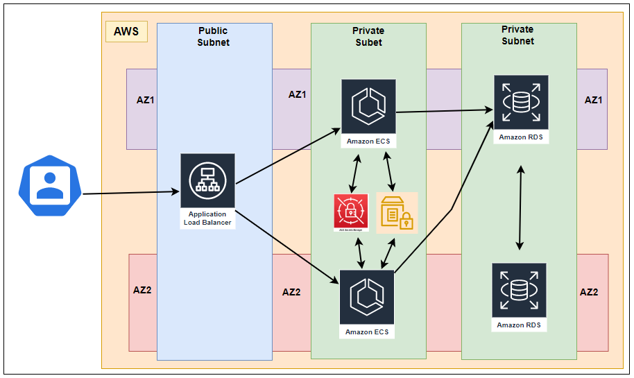
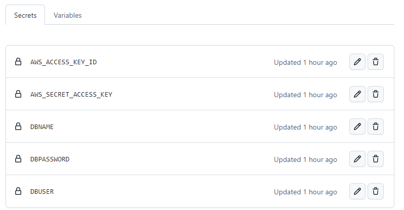
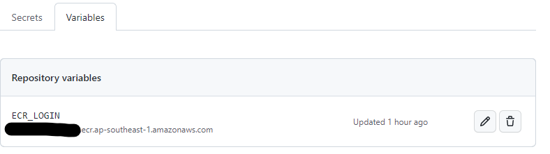
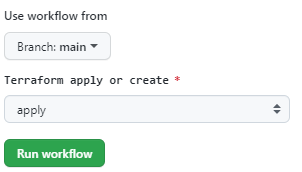
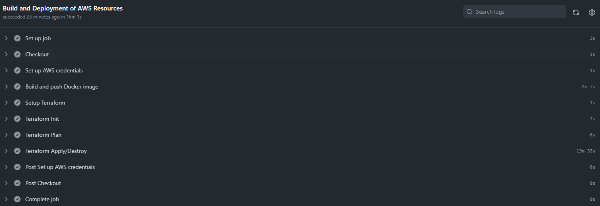

## Project
AWS Resilient App Project Demo 

## Resources Created
- ECS Fargate App
- Postgres RDS
- SSM Paramter Store
- Secret Manager
- IAM Roles with least privileges 
- Application LB to load balance the traffic
- VPC subnets with Network GW for private Subent and Internet GW for Public Subnet

## Architecture 
<kbd>
  
</kbd>

## Features

1. All sensitive values are stored in AWS Secret Manger such as DBUser, DBPassword, DBName
2. Non sensitive values are stored in SSM Parameter store, which is passed to ECS tasks on runtime which helps to update the configuration easily 
3. App and RDS Postgres are created in private subnet thereby reduce the risk
4. ALB is hosted in public subnet and serve the traffic to App and helps in distributing the traffic in equally
5. ALB is also enabled with health check. So traffic to non-healthy tasks will be not forwarded
6. Autoscaling on ecs is enabled
7. Multi-AZ is enabled for RDS, which helps for resiliency of the app
8. Secret in GIT is stored as Git secret to avoid secret leakages
9. Logging is enabled for ecs tasks, which helps in troubleshooting
10. IAM roles with least privileges and only required permissions in assigned 
11. RDS is only allowed traffic from ECS app 

__Future Enhancements__  - We can buy a domain in R53 and add a HTTPS certificate hosted in ACM  to the ALB to make the app more secure

## Pre-Requisites

1. Create a  __S3 Bucket__ to store the Terraform backend file and update the __main.tf__
```terraform
terraform {
  backend "s3" {
    bucket = "servian-devops-tf"
    key    = "gitaction"
    region  = "ap-southeast-1"
  }
}
```

2. Create ECR repo to host the docker container images

3. Create an IAM user with required privileges and download the accesskey id and secret access key

4. Create GitHub __Secrets__ and __Variables__

<p align="center">
  <b>Secrets</b>
</p>

- **_AWS_ACCESS_KEY_ID_** : AWS Access Key ID
- **_AWS_SEC_ACCESS_KEY_** : AWS Secret Access Key
- **_DBUSER_** : Database UserName
- **_DBPASSWORD_** : Database Password
- **_DBNAME_** : Database Name

<kbd>
  
</kbd>

<p align="center">
  <b>Variables</b>
</p>

- **_ECR_LOGIN_** : Container Registry login url

<kbd>
  
</kbd>

8. Fill the __terraform.tfvars__
```terraform
project_name        = "servian"
VPC_CIDR            = "10.10.10.0/24"
PublicSubnet_CIDR1  = "10.10.10.128/26"
PublicSubnet_CIDR2  = "10.10.10.64/26"
PrivateSubnet_CIDR1 = "10.10.10.0/26"
PrivateSubnet_CIDR2 = "10.10.10.192/26"
Public_AZ1          = "ap-southeast-1a"
Public_AZ2          = "ap-southeast-1b"
Private_AZ1         = "ap-southeast-1b"
Private_AZ2         = "ap-southeast-1a"
disk_size           = 20
engine_version      = "13.7"
instance_size       = "db.t3.micro"
storage_type        = "gp2"
```

## Terraform Build
1. Go to GitHub -> Actions
2. Select the Branch and Apply

<kbd>
  
</kbd>

<p align="center">
  <b>Pipeline</b>
</p>

<kbd>
  
</kbd>

## Terraform Destroy
1. Go to GitHub -> Actions
2. Select the Branch and Destroy
<kbd>
  
</kbd>
